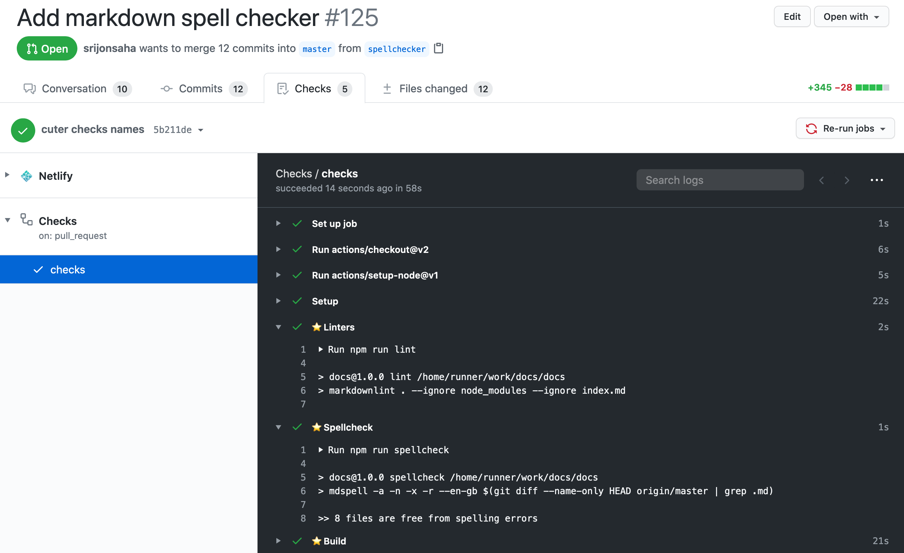

# Contributing to docs.ubclaunchpad.com

> Source repository: [`ubclaunchpad/docs`](https://github.com/ubclaunchpad/docs)

If you just have an idea for a change but don't want to implement it yourself,
add an [issue](https://github.com/ubclaunchpad/docs/issues) to this repository
(but make sure to check for duplicates first). Be descriptive!

## Making a Change

The content in this website is written in [Markdown](https://github.com/adam-p/markdown-here/wiki/Markdown-Cheatsheet), a plain-text markup format. We use [VuePress](#vuepress) to convert Markdown files into this website - making a change to `docs.ubclaunchpad.com` simply involves editing these files and creating a [pull request](/handbook/tools/github.md#pull-requests).

Once you've made your pull request, [Netlify](https://www.netlify.com/) will then deploy a preview of your change - see [Deployment](#deployment). GitHub Actions will also runs checks to tell you if anything is wrong - see [Checks](#checks).

### The Easy Way

The easiest way to make a quick change is to simply hit the "Help us improve this page" link that's available on the bottom of every page:


This will open up an editor in the GitHub interface, where you can make small changes and submit them as a pull request entirely from your browser.

### The Complete Way

While the [Easy Way](#the-easy-way) is good for small changes, writing larger chunks of content is best done from the comfort of your computer. To do this, make sure you have [Node.js](https://nodejs.org/en/) installed, then:

1. Download the repository and create a new branch locally:
   ```
   git clone https://github.com/ubclaunchpad/docs.git
   git checkout -b my-new-branch
   ```
2. Make changes and commit them (make sure you have [good commit messages](https://chris.beams.io/posts/git-commit/#seven-rules)!)
   * We recommend using [Visual Studio Code](https://code.visualstudio.com/).
3. Run `npm install` and `npm run lint` to ensure your code follows our style rules.
   * (optional) run `npm run serve` to test out the updated website locally!
4. Push your local branch to the remote repository using `git push origin HEAD`
5. Make a pull request on GitHub's web interface (and make sure to fill out the provided template!)

More details on using `git` are available in our [Git Workflow guide](./resources/git-workflow.md).

## Structuring Content

In general:

* `handbook/` should have Launch Pad-specific documentation (some of it might be generally useful, however - if so, link to it from Resources)
* `resources/` should have general learning resources
* Before creating a new section, look for an existing section where your new content could live instead, and create links from other relevant sections if possible.
* Feel free to add a badge to new or updated content:
  ```
  <Badge type="tip" text="new"/>
  ```
* Images should go in a `/img` folder in the same directory.
* Headers can *start* with emoji, but don't put emojis anywhere else in a header!
* Use **relative links** to content within the website - this means `/handbook/file.md` instead of `https://docs.ubclaunchpad.com/..`!

### Nested Folders

Any folders deeper than the top-level documents (such as `handbook/`, `resources/`) should *not* have a dedicated README in its folder - instead, a "table of contents" of the directory should be placed in one of the top-level documents' READMEs. For example, the contents of `resources/project-management` are listed in `resources/README.md` and *not* `resources/project-management/README.md`.

When adding a new file to a subfolder of content (for example, `handbook/tools`), make sure you:

* add a link to `handbook/README.md`
* if the subfolder has a [defined sidebar group](https://sourcegraph.com/search?q=repo:%5Egithub%5C.com/ubclaunchpad/docs%24+file:%5E%5C.vuepress/config%5C.js+sidebar&patternType=literal), add your new page to the group

## Technical Details

### Scripts

This repo offers some `package.json` scripts to help you out:

```sh
npm install           # installs our standard Markdown linter and site builder
npm run lint          # runs the linter to check for style errors
npm run spellcheck    # runs markdown spell checker on all changed files
npm run serve         # runs the website locally
```

### VuePress

This website is based on [VuePress](https://vuepress.vuejs.org/guide/) - refer to the
VuePress documentation for more details. VuePress takes the [Markdown](https://github.com/adam-p/markdown-here/wiki/Markdown-Cheatsheet) content in this repository (all those `.md` files) and turns them into the pretty website on `docs.ubclaunchpad.com`.

Most VuePress configuration lives in [`.vuepress/config.js`](https://sourcegraph.com/github.com/ubclaunchpad/docs/-/blob/.vuepress/config.js).

#### Analytics

We use [Fathom Analytics](https://usefathom.com/) to track visits and interactions on the website (via [`@ubclaunchpad/vuepress-plugin-fathom`](https://github.com/ubclaunchpad/vuepress-plugin-fathom)). Since most of the site is just plain Markdown, the only [goals](https://usefathom.com/support/goals) we track are interactions with search suggestions - see [`fulltextSearchFunctions.js`](./.vuepress/fulltextSearchFunctions.js) for more details.

The site's analytics dashboard is available [here](https://app.usefathom.com/share/oemmhhle/docs.ubclaunchpad.com).

#### Search

Search for this website is implemented through the UBC Launch Pad project [`vuepress-plugin-fulltext-search`](https://github.com/ubclaunchpad/vuepress-plugin-fulltext-search) (also aliased as `fulltext-search`), which is a fork of an open-source project that contains a variety of new features and customizations tailored for this website.

It contains a significant amount of hackery - to learn about customizing and improving our search, look at:

1. The [search plugin's usage documentation](https://github.com/ubclaunchpad/vuepress-plugin-fulltext-search/blob/master/README.md)
2. [`.vuepress/config.js`](https://sourcegraph.com/github.com/ubclaunchpad/docs/-/blob/.vuepress/config.js), particularly the `plugins` section
3. [`fulltextSearchFunctions.js`](https://sourcegraph.com/github.com/ubclaunchpad/docs/-/blob/.vuepress/fulltextSearchFunctions.js), where hooks to the plugin are defined
4. Based on what you are interested in:
   * [Indexing code](https://sourcegraph.com/github.com/ubclaunchpad/vuepress-plugin-fulltext-search/-/blob/services/flexsearchSvc.js)
   * [Matching code](https://sourcegraph.com/github.com/ubclaunchpad/vuepress-plugin-fulltext-search/-/blob/services/matchQuery.js)
   * [Search box](https://sourcegraph.com/github.com/ubclaunchpad/vuepress-plugin-fulltext-search/-/blob/components/SearchBox.vue)
   * [Search library documentation](https://github.com/nextapps-de/flexsearch#api-overview)

If you make a change in the plugin, you must [update the pinned commit in `package.json`](https://sourcegraph.com/search?q=repo:%5Egithub%5C.com/ubclaunchpad/docs%24+file:%5Epackage%5C.json+%28%22vuepress-plugin-fulltext-search%22:+%22%29.*&patternType=regexp) and run `npm install` to update `package-lock.json`.

### CI/CD

#### Deployment

Deployments are handled automatically by the [Netlify](https://www.netlify.com/) - the website is managed under the "Launch Pad OSS Sponsored" team. Build and deploy options can be declared in [`netlify.toml`](./netlify.toml).

This means that when your changes are merged to `master`, your contribution will automatically be deployed!

Also note that individual pull requests also get their own preview deployment - Netlify will comment on your pull request with a link to the preview. This is useful for reviewing changes! Look out for a comment from the Netlify bot.

#### Checks

We use [GitHub Actions](https://github.com/features/actions) to run checks to make sure the website content is nicely formatted and mostly correct. You can see the output under the "Checks" tab on your pull request - whenever you open a pull request, check this tab to see if anything needs your attention!



We have the following Actions set up:

* [](https://github.com/ubclaunchpad/docs/actions?query=workflow%3AChecks) ([`checks.yml`](./.github/workflows/checks.yml))
  * Linter: this step checks if your Markdown is formatted correctly.
  * Spellcheck: this step checks if your spelling is good. Since the tool often reports false positives, misspellings won't fail your pull request, but you should still check!
* [](https://github.com/ubclaunchpad/docs/actions?query=workflow%3A%22Compress+images%22) ([`compress.yml`](./.github/workflows/compress.yml))
  * This runs whenever images are added - if an image's size can be reduced, this tool will automatically compress it and push it to your branch!

::: tip Note on the spellchecker
The spellchecker dictionary is not very robust. It may sometimes mark correct spellings as errors. You can add misidentified spellings to the dictionary via the [`.spelling`](./.spelling) file.
:::
