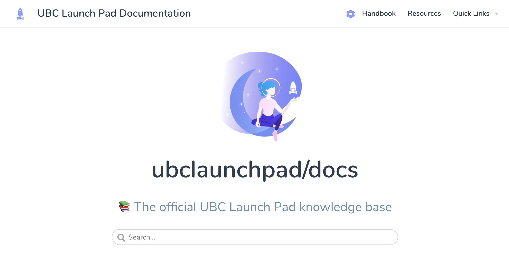

<p align="center">
  <a href="https://docs.ubclaunchpad.com">
    
  </a>
</p>

<h3 align="center">
  <a href="https://docs.ubclaunchpad.com">docs.ubclaunchpad.com</a>
</h3>

<p align="center">
  UBC Launch Pad's official knowledge base.
</p>

<p align="center">
  <a href="https://github.com/ubclaunchpad/docs/actions?workflow=Checks">
    
  </a>
  <a href="https://app.netlify.com/sites/ubclaunchpad-docs/deploys">
    
  </a>
  <a href="https://docs.ubclaunchpad.com">
    
  </a>
  <a href="https://app.usefathom.com/share/oemmhhle/docs.ubclaunchpad.com">
    
  </a>
</p>

<br />

<!-- markdownlint-disable -->

## ⚒️ Contributing

To get started:

```sh
git clone https://github.com/ubclaunchpad/docs.git
cd docs
```

Then make the changes you want to make to the site's content, commit it, and make a pull request! Optionally:

```sh
npm install    # install dependencies
npm run serve  # run website locally
```

Head on over to the [Contribution Guide](./CONTRIBUTING.md) for more details!
