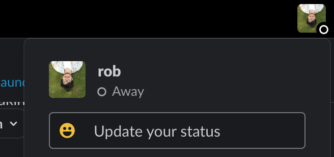
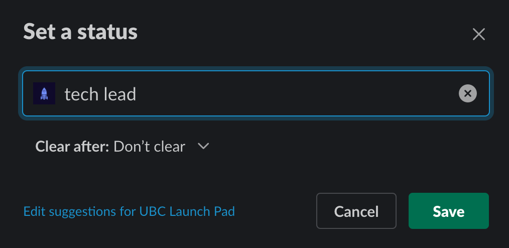

# 🎉 Onboarding for Leads

Welcome to UBC Launch Pad, and congratulations (and thank you!) for joining us as a lead!

The role of the Launch Pad leadership team is documented in our [manifesto](/handbook/manifesto.md#club-structure). The specifics of each role's responsibilities are also available in the [tech lead role description](/handbook/recruitment/tech-lead.md) and [design lead role description](/handbook/recruitment/design-lead.md).

## Checklist

### Slack Channels

Everyone should join a **private** channel named `#tm-leads-YYYY` (for example, `#tm-leads-2020`). If this channel doesn't exist yet, coordinate to get it created. This will be the primary means through which Launch Pad leadership works together. In addition, make sure you join:

* [`#ask-leads`](https://ubclaunchpad.slack.com/archives/CK935RD3Q): this is where members are expected to direct questions at leadership.
* [`#ask-rocket`](https://ubclaunchpad.slack.com/archives/CK93HTYQN): our Slack bot [Rocket](https://github.com/ubclaunchpad/rocket2) is how teams are set up and managed - make sure you familiarize yourself with the app and ask this channel if you have questions or something is broken.
* [`#ask-design`](https://ubclaunchpad.slack.com/archives/CK6D4QD8U): questions for design
* [`#ask-strategy`](https://ubclaunchpad.slack.com/archives/CJVF0FQHG): questions for strategy

As a lead, you should also lead in Slack participation by example - please make sure you join any channels you find interesting and participate in them! See [our Slack guide](/handbook/tools/slack.md#finding-channels) for more details.

### Slack Status

To help people identify you, make sure you set a status in Slack indicating your role!





### Rocket Team

Make sure you get added to the `leads` [Rocket](/handbook/tools/slack#rocket) team by the co-presidents. Co-presidents should also make sure they are added to the `exec` Rocket team.

### GitHub Teams

Make sure you are a part of the following teams on GitHub - [Rocket](/handbook/onboarding/everyone.md#rocket-setup) should do this for you if you are a part of the `leads` Rocket team. Ceck your email for an invitation! Please do not ask to be added directly without checking with `#ask-rocket` if there is a problem.

* [`@ubclaunchpad/leads`](https://github.com/orgs/ubclaunchpad/teams/leads), and check that you can access the [private Leads repository](https://github.com/ubclaunchpad/leads) - this repository primarily contains interview resources and tracking issues
* [`@ubclaunchpad/strategy`](https://github.com/orgs/ubclaunchpad/teams/strategy), and check that you can access the [private Strategy repository](https://github.com/ubclaunchpad/strategy) - this repository contains sponsorship resources and event/sponsorship tracking issues
* [`@ubclaunchpad/design`](https://github.com/orgs/ubclaunchpad/teams/design), and check that you can access the [public Design repository](https://github.com/ubclaunchpad/design) - this repository contains (some) design assets, resources, and tracking issues

Additionally, the presidents should also be a part of [`@ubclaunchpad/exec`](https://github.com/orgs/ubclaunchpad/teams/exec) and familiarize themselves with the [Exec repository](https://github.com/ubclaunchpad/exec), where we keep track of accounts, credentials, handoff instructions, and more. Permissions for this repository is granted with the `exec` Rocket team.

::: tip
Make sure that you are **watching** all relevant repositories so that you don't miss any updates! To learn more about setting up your GitHub notifications, check our [GitHub guide](../tools/github.md#setting-up-notifications).
:::

### Google Drive

Make sure all leads are given "editor" access to the [shared Launch Pad folder](https://drive.google.com/drive/folders/1u-U3w0V0MaLQrWtDdw_8n15V2lO-6gXo), which is owned by the `team@ubclaunchpad.com` account (more details are in the [Exec repository](https://github.com/ubclaunchpad/exec)). [Rocket](#rocket-setup) should do this for you - check your email for an invitation! Please do not ask to be added directly without checking with `#ask-rocket` if there is a problem.

Learn more about managing these folders in the [Google Drive documentation](/handbook/tools/drive.md).

### Email and Accounts

All leads will be given access to the `strategy@ubclaunchpad.com` Gmail account to help in correspondance with partners and sponsors. Learn more about Launch Pad email in [the email documentation](/handbook/tools/email.md).

To gain access to various social media accounts, see the [social media documentation](/handbook/tools/social-media.md).

## Workflows

::: tip
We use GitHub and Slack for pretty much *everything* - make sure you are intimately familiar with **both**, regardless of your role, by reading our handcrafted guides:

* [GitHub guide](/handbook/tools/github)
* [Slack guide](/handbook/tools/slack)
:::

### Recurring Processes

The Leadership team is responsible, with the help of the Strategy team, for implementing our [recurring processes](/handbook/strategy/recurring-processes.md). This includes selecting the next generation of Launch Pad leads, working towards our club objectives, and more.

### Projects and Teams

The handbook's Project Management pages are a must-read - for all leads:

* [Scope](../project-management/scope.md) - how to develop and scope ideas for Launch Pad projects, as well as a suggested timeline for your team's progress.
* [Sprints](../project-management/sprints.md) - how to plan and collaborate with your team to deliver on your project, including advice on how to run meetings.

Additionally, technical leads will want to take a look at the [Repository Management](/handbook/project-management/repositories) page for advice on how to set up tooling for their projects.

#### Starting a Team

Team formation happens in [kickoff events](/handbook/strategy/recurring-processes.md#project-ideation). Once teams have formed, follow these steps to get started!

1. Create a **public** Slack channel using the [naming scheme](/handbook/tools/slack.md#naming-slack-channels) (e.g. `#tm-TEAMNAME`), and add all the developers and designers in your team to the channel.
   1. Make sure everyone on your team has set up their Rocket profiles, as per the [onboarding](/handbook/onboarding/everyone.md#rocket-setup).
2. Run the following command in Slack so that Rocket can set up your GitHub team:

   ```
   /rocket team create TEAM_NAME --lead SLACK_HANDLE --channel TEAM_CHANNEL
   ```

   For example, if your team name is `Facebook for Cats`, your Slack handle is `@Jane Doe`, and the team Slack channel you created in step 1 is called `#tm-facebook-for-cats`, then you should write:

   ```
   /rocket team create "Facebook for Cats" --lead @Jane Doe --channel #tm-facebook-for-cats
   ```

   ::: tip
   Note that the `SLACK_HANDLE` and `TEAM_CHANNEL` parameters will be parsed by Slack as tags, so spaces are okay. If you have spaces in your team name, however, please ensure that you surround it in quotation marks like the example.

   
   :::

3. Set up your repository!
   1. Verify that your team has been created in the [GitHub teams page](https://github.com/orgs/ubclaunchpad/teams). If your team members have set up Rocket correctly, they should all be in the team.
   2. [Create a repository](https://github.com/organizations/ubclaunchpad/repositories/new). When doing so, make sure you check "Add a README file" so that GitHub can initialize the Git repository as well (you can also initialize it manually afterwards by pushing to the repository if you want). Under your new repository's "Settings" page, go to "Manage access" and:
      1. Invite the GitHub team Rocket created for you with "Maintain" permission.
      2. We recommend you create public repositories, but if you want to start off with a private repository, invite the `ubclaunchpad/all` team as well with "Write" permission.
   3. We recommend that you set up branch protection - under "Settings", go to "Branches" and add a rule for your default branch with "Require pull requests before merging". You can add more rules once you have more tooling set up for your repository - see [Repository Management](/handbook/project-management/repositories) for ideas.
   4. Add a link to the repository in your Slack channel description.
4. Set up your drive folder!
   1. Within the shared "Launch Pad Projects" folder, create a folder for your team under your the appropriate year folder. You should not need to invite anyone to the folder.
   2. Create a document for all your meeting notes - see [sprint meetings](../project-management/sprints.md#sprint-meetings) for ideas.
   3. Add a link to your drive folder in your Slack channel description.
5. Announce your channel in the leads channel so that other leads can join in on your discussions!

#### Continuing a Team

Some teams may want to continue their projects for multiple semesters.
As a lead, please keep the following in mind before you decide to continue your team's project:

* New members cannot (generally) be recruited into an existing team.
  * There is a significant curve to onboarding someone not just to the project idea, but also to the tech stack and your individual team dynamics, in time for them to make meaningful contributions within the span of a single semester.
  * Historically, exceedingly few new members elect to join existing teams when we have offered this option in the past.
  * This reduces the number of new members we can take on each semester.
* If you decide not to continue a project, that does not mean the project is dead forever - Launch Pad repositories are generally open source, and there have been cases of projects continuing long after it ceases to be a standard active Launch Pad project.

Only continue a project if you are confident you will be retaining your team's most active members, and at least 75% of your team is enthusiastic about continuing.

#### 1-1's with Team Members

We recommend that leads schedule 1-1 ("one-on-one") meetings with their team members on a biweekly or monthly basis. Leads might want to make the first of these meetings mandatory, and keep the subsequent ones optional.

1-1's can run for 10 to 20 minutes each, and they are opportunities for leads to:

* Get to know their team members on a more personal level
* Figure out what their goals out and how they (or the rest of Launch Pad) can help them achieve those goals
  * Especially keep in mind that you will be asked to [nominate potential leads](/handbook/strategy/recurring-processes.md#leads), so encourage members who express interest in taking on this role!
* Determine if team members need any additional additional support from Launch Pad
* Get feedback about team and club operations

Leads should keep track of any noteworthy items to bring up during [leads meetings](#meetings).

#### Team Tools

Other than [Slack](/handbook/tools/slack.md), [GitHub](/handbook/tools/github.md), and [Google Drive](/handbook/tools/drive.md), we have a variety of recommended tooling listed in the [tools section](/handbook/README.md#tools).

**For team and knowledge management**, we recommend that leads stick to the recommended tools, so that each team's material is available for everyone to access, and to keep management tooling to a minimum - certain platforms like GitHub are already a bit of a learning curve for some members, on top of other technical tools they need to learn to leverage.

### Meetings

Leads meetings between all leads (technical and non-technical) should happen on a weekly basis. These meetings should have a [sprint meetings](../project-management/sprints.md#sprint-meetings)-style meeting notes document set up for the year. During meetings:

* The **co-presidents** will provide club updates and discussion topics.
* All **tech leads** will provide updates on their team's progress (including their designers). They should provide at least on highlight from their team for the week as well.
* The **design lead** will provide other non-team design updates or thoughts not brought up by leads. They should also bring up updates and feedback they have heard from designers, and provide at least one highlight from the designers for the week.

As everyone provides their updates, we should keep track of discussion topics to follow up on and spend the remainder of the meeting having any necessary discussions.

### Reimbursements

Reimbursement requests should be filed in the [Leads repository using the reimbursement template](https://github.com/ubclaunchpad/leads/issues/new?assignees=&labels=reimbursement&template=reimbursement.md&title=), which also contains follow-up instructions. Leads should handle filing this on behalf of team members where appropriate.

Co-presidents can find more details [in the Exec repository](https://github.com/ubclaunchpad/exec/blob/master/assets.md#finances).

## Further Reading

* [Recruitment](/handbook#recruitment)
* [Analytics](/handbook/tools/analytics.md)
* [Social Media](/handbook/tools/social-media.md)
* [`ubclaunchpad.com` Usage Guide](https://github.com/ubclaunchpad/ubclaunchpad.com/blob/master/USING.md)
* [`ubclaunchpad.com` Configuration Guide](https://ubclaunchpad.com/config/)
