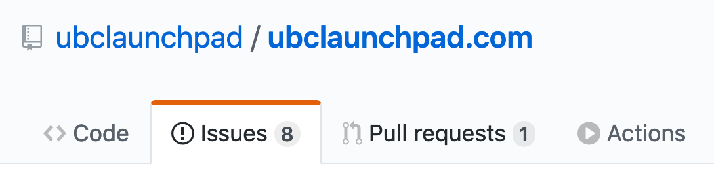
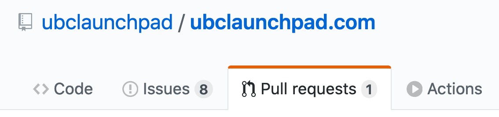
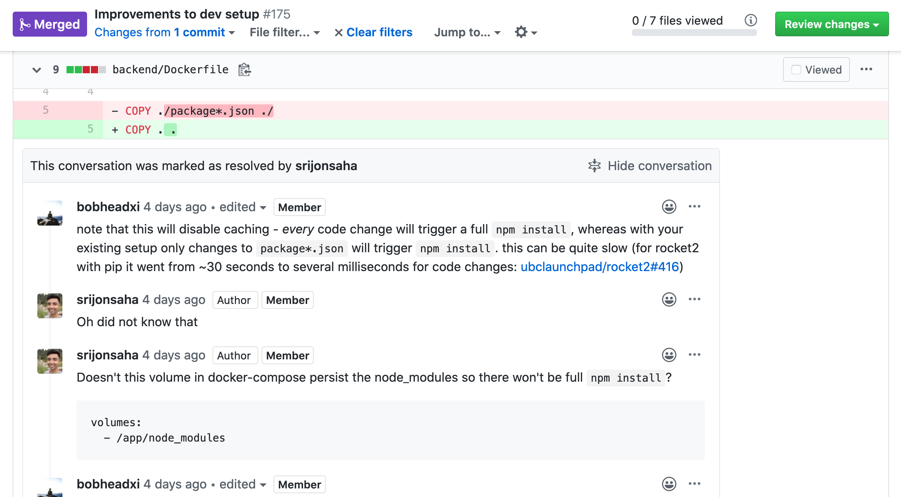
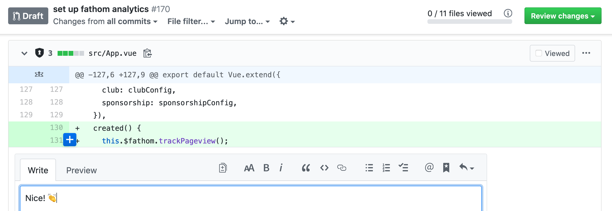
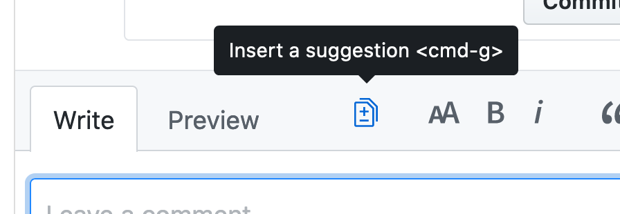
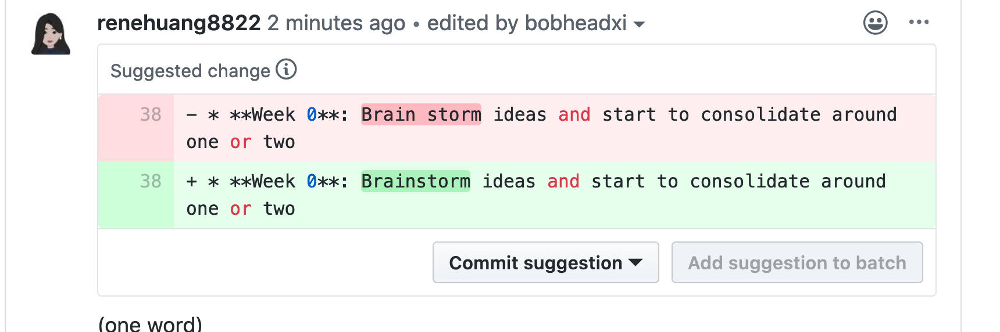
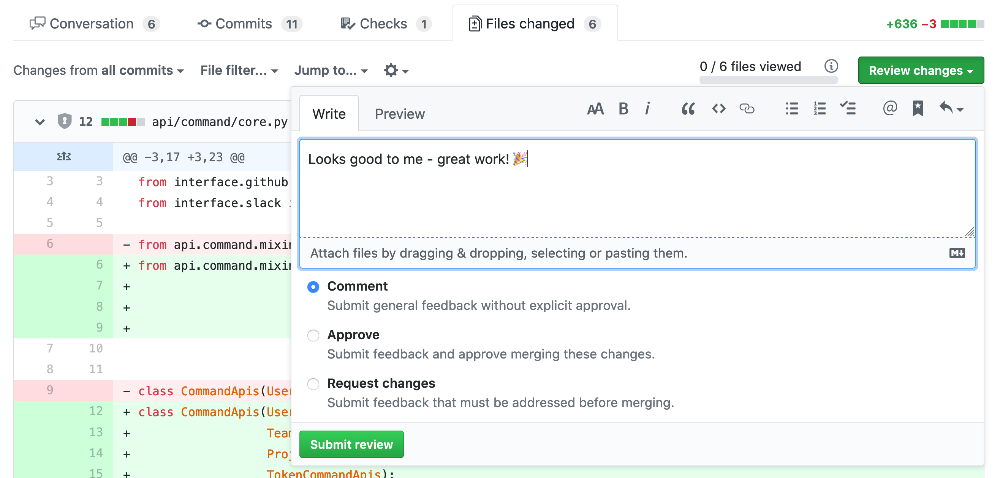
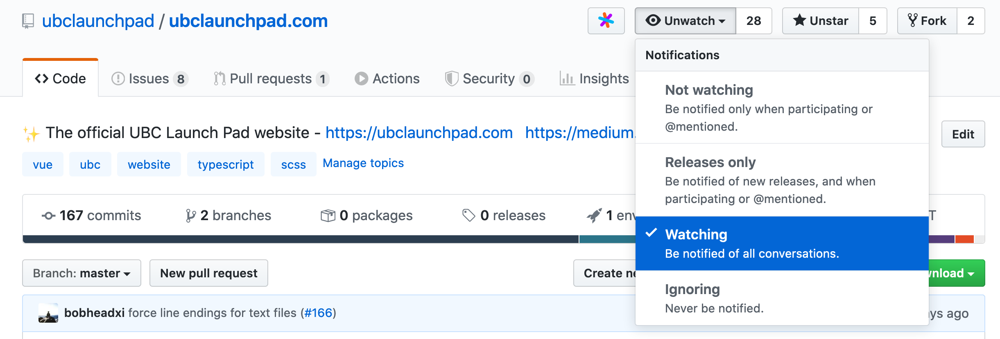
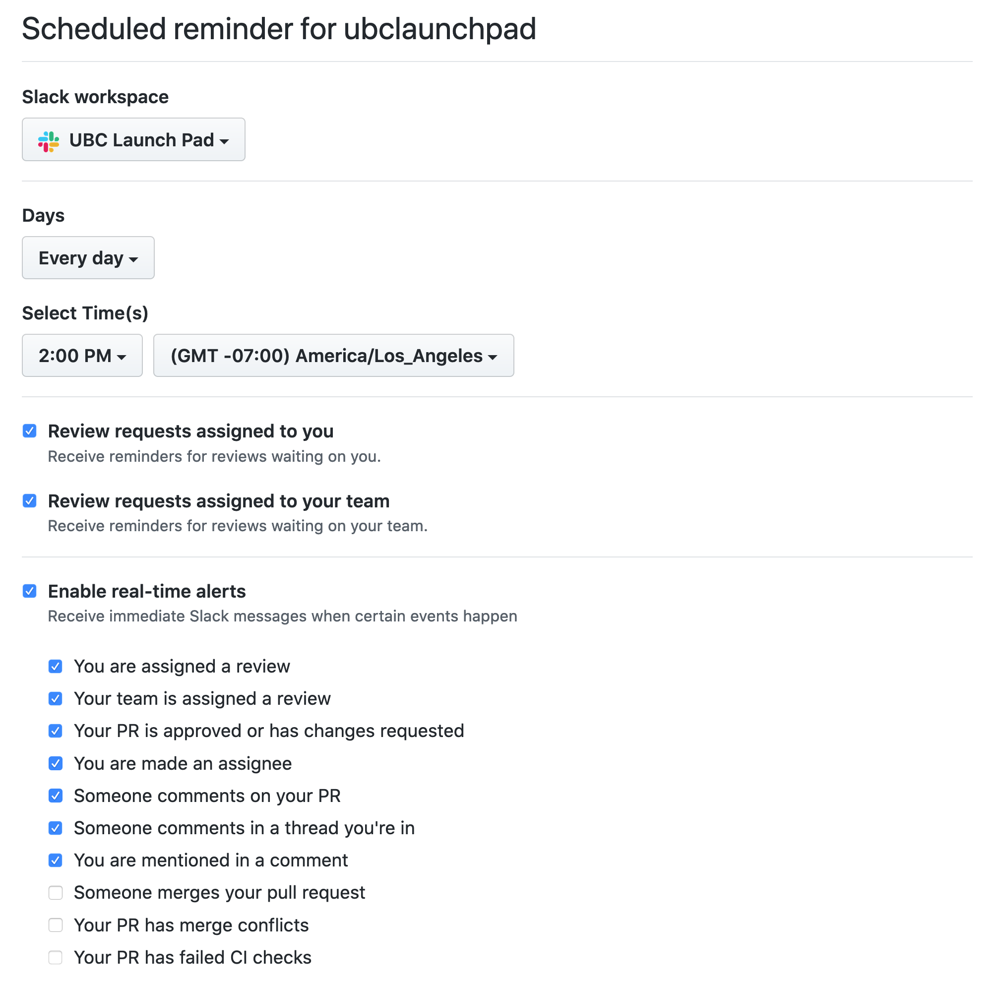
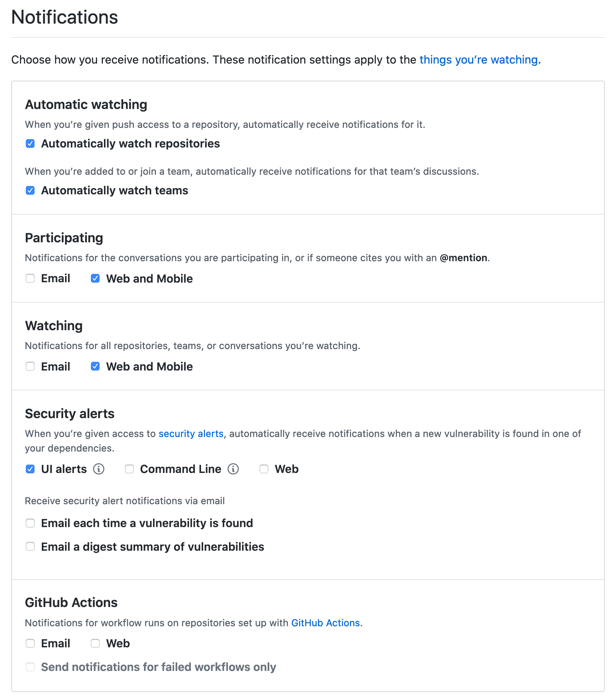

# 🐙 GitHub <Badge type="tip" text="new"/>

We use [GitHub](https://github.com/) to host, document, and manage the code in all our projects. Our GitHub organization is [`ubclaunchpad`](https://github.com/ubclaunchpad/), and each repository is essentially a version-controlled folder of files (similar to what you might find on your computer).

That means each project has an associated GitHub repository, and documentation for the project should live in that repository, either as files in the repository alongside your code or in discussions around [issues](#issues) and [pull requests](#pull-requests).

::: warning
Using GitHub is especially important because **our [Slack workspace](./slack.md) does not retain messages forever** - any long-term knowledge, information, and discussions should be enshrined *somewhere* in a repository!
:::

This page gives you some background knowledge that we hope will help you make the most of GitHub off the bat, whether you're a developer, designer, or strategy member. For more advanced usage, check out [Repository Management](../project-management/repositories.md) for guidelines on how to manage your GitHub repository and enforce coding standards and our [Git Workflow guide](../../resources/git-workflow.md).

## Basics

### Markdown

Markdown is a lightweight markup language designed to help you write formatted text without a heavyweight editor like Microsoft Word or Google Docs. You can write:

* **bold statements**
* *italicized whispers*
* :astonished: emoji
* [linked text](./github.md#markdown)
* lists, tables, headings, and more!

For example:

```md
Markdown is a lightweight markup language designed to help you write formatted text without a heavyweight editor like Microsoft Word or Google Docs. You can write:

* **bold statements**
* *italicized whispers*
* :astonished: emoji
* [linked text](./github.md#markdown)
* lists, tables, headings, and more!
```

This makes it easy and consistent to write, and easy for tools to interpret and render nicely (this page is rendered from a Markdown file!). Markdown works pretty much anywhere in GitHub, and writing Markdown on a `.md` file in your repository automatically formats it when you open it on GitHub. For example, check out `ubclaunchpad/ubclaunchpad.com`'s [`CONTRIBUTING.md` file on GitHub](https://github.com/ubclaunchpad/ubclaunchpad.com/blob/master/CONTRIBUTING.md)! (here's the [plain text version](https://raw.githubusercontent.com/ubclaunchpad/ubclaunchpad.com/master/CONTRIBUTING.md) for reference).

For more about using Markdown, check out these handy cheatsheets:

* [GitHub's Markdown Cheatsheet](https://guides.github.com/pdfs/markdown-cheatsheet-online.pdf) - this one is short and to the point
* [`markdown-here` Cheatsheet](https://github.com/adam-p/markdown-here/wiki/Markdown-Cheatsheet) - this one has more examples
* [Markdown Emoji Cheatsheet](https://www.webfx.com/tools/emoji-cheat-sheet/) - :wink:

### Git

At its core, GitHub is a website that hosts your "git repositories" for you. Git is a version-control system that helps you maintain a permanent record of *what* changed, *who* changed it, and *why* the change was made. You can think of a repository as a series of "commits", each one recording a change (known as a "diff"), a message, and some other useful information:

```diff
commit a738c380199d03d8f29c7904b465215a7437bd5e
Author: Robert Lin <robert@bobheadxi.dev>
Date:   Thu May 14 14:51:11 2020 -0700

    update project timeline (#71)

index 956d30c..6963d00
--- a/my-file.md
+++ b/my-file.md
- Hello
+ Hello world!
```

Learn more about using git in our [Git Workflow guide](../../resources/git-workflow.md)!

## Issues

[GitHub Issues](https://help.github.com/en/github/managing-your-work-on-github/about-issues) are our primary means of tacking tasks and having structured, long-term discussions about tasks. Learn more about how we define tasks in [Sprint Planning: Tasks](../project-management/sprints.md#tasks).

You can see each project's issues under its repository's `Issues` tab:



Each issue's description is a space where you can write nicely-formatted [Markdown](#markdown) to describe a task. For each issue, you can also:

* add comments for discussions
* assign teammates
* attach [labels](https://help.github.com/en/github/managing-your-work-on-github/applying-labels-to-issues-and-pull-requests)
* add it to a [milestone](https://help.github.com/en/github/managing-your-work-on-github/viewing-your-milestones-progress)
* attach relevant [pull requests](#pull-requests)
* link them to other issues or pull requests by number (for example, by writing `#14`)
* mention your buddies (for example, by writing `@bobheadxi`)
* manage them in [GitHub Projects](https://help.github.com/en/github/managing-your-work-on-github/about-project-boards)
* mark them as "closed" when complete

...and more! Here's an example:


There are more examples of good issues in our [Sprint Planning: Tasks](../project-management/sprints.md#tasks) page.

## Pull Requests

[GitHub Pull Requests](https://help.github.com/en/github/collaborating-with-issues-and-pull-requests/about-pull-requests) are the primary way to introduce, discuss, and enact a change. You can see each project's pull requests under its repository's `Pull Requests` tab:



Similar to the a "commit", which we mentioned in the [Git introduction](#git), a pull request represents a "diff" (available in a pull request's "Files Changed" tab) which can be a combination of many "commits". You can learn more about **creating** pull requests in our [Git Workflow guide](../../resources/git-workflow.md).

Note that everything you can do with an [issue](#issues), you can do with a pull request! That means crafting detailed Markdown descriptions, comments, labels, and more!

### Reviewing Pull Requests

One of the most important activies you'll participate in as a member of Launch Pad is **reviewing pull requests**, as it is a core part of collaborating on projects in a systematic manner. A review typically involves looking at the changes in a pull request and leaving *any* sort of comment. Pull requests are the perfect place to:

* ❓ **Ask questions** about something you don't understand or are unsure about (both as a reviewer, and as the creator of a pull request!)
* 💡 **Learn** how to implement features - since pull requests often have a single purpose, it's a good way to see what changes are required to do something. You will learn new things from how your peers write code and you will be more aware of how to write code that is easier for your reviewers to understand.
* 💭 **Raise suggestions** about a possible improvement to the change - receiving such feedback can give you valuable insight into aspects of a change that you hadn’t considered, and being a reviewer gives you the ability to share knowledge you have that others do not. Every person, regardless of experience level, has both something to learn and something to contribute!
* 📝 **Record** why changes are made - you can go through a repository's history to find pull requests associated with a file to better understand why things are the way things are. Writing a good PR description (and commit messages) also develops your technical communication skills.
* 👏 **Support and celebrate** your teammates' hard work by showing that you've looked at their changes and appreciate their contributions!

For more details, the [Sourcegraph company handbook](https://about.sourcegraph.com/handbook/engineering/code_reviews#why-do-we-require-peer-code-reviews) has an excellent section on why the company requires pull request reviews - it covers rationale common in the industry.



#### Leaving Comments

You can leave simple comments on pull requests similar to comments on [issues](#issues), but you can also leave comments on specific lines to give your feedback some more context:



Each comment can leverage [Markdown](#markdown) formatting, but there are some other tricks you can leverage in your comments, such as suggestions:

| Before | After |
|--------|-------|
|  |  |

You can leave a final word on a pull request by **approving** it (indicating the pull request author should feel free to add their changes to the repository, aka "merging") or **requesting changes** with the "Review changes" button:



## Setting Up Notifications

### Watching Repositories

"Watching" a repository is the only way to receive consistent notifications for updates to it. To watch a repository:



Make sure you do this for all repositories relevant to your team(s)!

### Getting Notifications

By default, GitHub sends you emails for everything that you are subscribed to. Since this can be rather annoying, you might want to disable that and have Launch Pad GitHub notifications arrive in you Slack messages instead - this way, you don't have to deal with a ton of spam in your personal email and you won't miss any important discussions with your team!

1. Set up Slack notifications [here](https://github.com/settings/reminders/ubclaunchpad) - recommended options:


2. Disable emails [here](https://github.com/settings/notifications) - recommended options:

