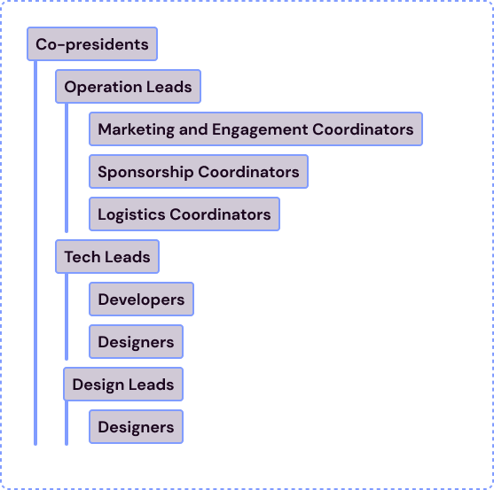

# 📍 Overview

This document provides an overview of the people and roles at [UBC Launch Pad](https://ubclaunchpad.com).

## Roles

Launch Pad is always evolving and with that roles change. Currently the club has many great people in it.

Learn more about recruitment process here: [Recruitment Process](./recruitment-process.md)

### Co-presidents

Co-presidents help steer Launch Pad and make sure the club sticks to its goals and values.

### Strategy Roles

The Strategy team is a unique and vital part of UBC Launch Pad. Strategy team members are responsible for planning and executing workshops, events, internal engagement, and expanding our club's presence externally.

This team is for those who are passionate about operational roles, networking, planning, marketing, and community engagement. Check out the resources below for more details.

- [Operations Lead](./operations-lead.md)
- [Sponsorships Coordinator](./sponsorships-coordinator.md)
- [Marketing and Engagement Coordinator](./engagement-coordinator)
- [Logistics Coordinator](./logistics-coordinator)

### Technical Roles

The Technical roles include developer and tech lead roles. As a developer you will be working within teams led by one or two tech leads. Check out the resources below for more details.

There are two technical roles:

- [Tech Lead](./tech-lead.md)
- [Developer](./developer.md)

### Design Roles

The Design Designers take on projects both external and internal ones. Designers work within teams led by tech leads or design leads. Check out the resources below for more details.

There are two design roles:

- [Design Lead](./design-lead.md)
- [Designer](./designer.md)

## Appendix

 

    

